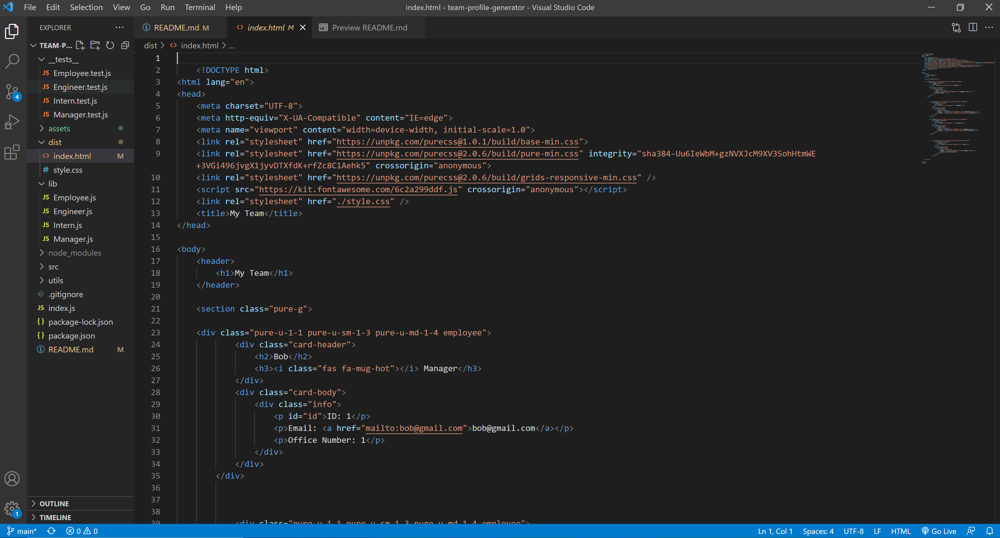

# Team Profile Generator


[](https://choosealicense.com/licenses/mit/)

## Description
Generates a webpage that displays a team's information from user input to give quick access to team member emails and GitHub profiles.


Watch a [Team Profile Generator Demo](https://drive.google.com/file/d/1XjmB_SZPRwFqfwd1ZZil-pxzO3VGqvpc/view?usp=sharing).

## Table of Contents
* [Installation](#installation)
* [Usage](#usage)
* [License](#license)
* [Testing](#testing)

## Installation
1. Install [Node.js](https://nodejs.org/en/) if you haven't already.
2. Clone this repository onto your computer.
3. Navigate to the root of this repository on the command line.
4. Run `npm install inquirer` on the command line to install Inquirer.

## Usage
1. Navigate to this repository's root directory on the command line.
2. Run `node index.js`.
3. Answer the question prompts about your team as shown below:


4. You can find the generated `index.html` in the `dist/` folder.

To open the `index.html` from the command line, type `code index.html` from the dist directory:



To view the generated webpage, open `index.html` in the browser.

## License
Licensed under the [MIT](https://choosealicense.com/licenses/mit/) license.

## Testing
To test the modules for the Employee, Manager, Engineer, and Intern classes:

1. Run `npm install --save-dev jest` on the command line to install Jest.
2. Open `package.json` in your code editor.
3. Replace the `test` value with "jest" as shown below:
```javascript
"scripts": {
    "test": "jest"
},
```
4. Run `npm test` from the root of the repository on the command line.